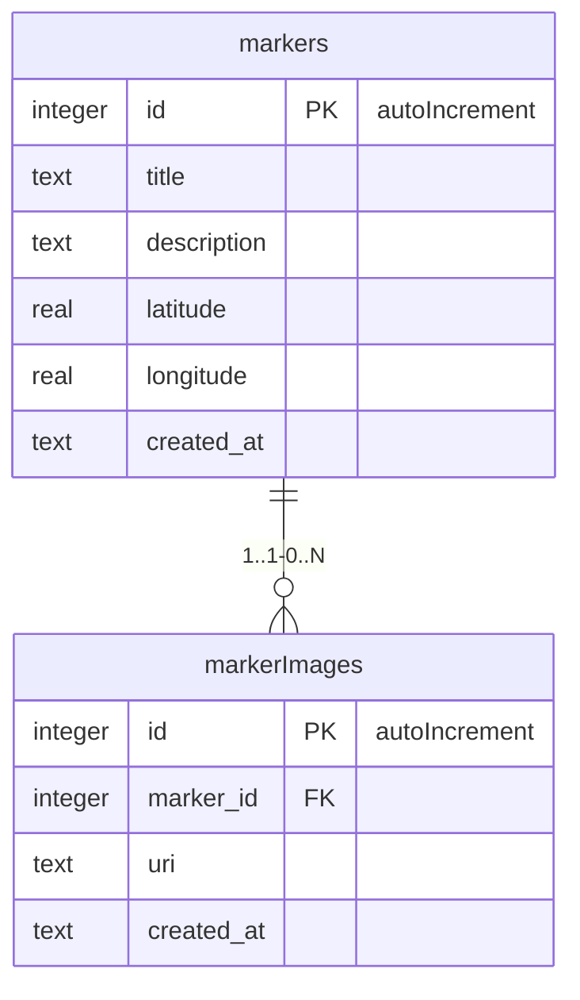

# SpotRate

## Начало работы 

1. Установка зависимостей

   ```bash
   npm install
   ```

2. Запуск приложения

   ```bash
    npx expo start
   ```

## Тестирование

1. Скачайте приложение `Expo Go` на смартфон
2. Убедитесь, что ПК, на котором запущен сервер, находится в одной сети со смартфоном
3. Отсканируйте QR-код в консоли через `Expo Go`

## Лаб. 1

### Разработка

#### Принятые решения

Для хранения данных маркеров в этой работе использован `Context` из `'react'` (т.к. в этой работе не используется БД)

#### Дополнительный функционал

1. Получение локации пользователя и перемещение к ней
2. Закрытие окна маркера свайпом вниз

### Известные проблемы

По какой-то причине переход к локации пользователя первый раз может происходить долго, хотя, судя по логам, права и локация уже получены

## Лаб. 2

### Подготовка

Для организации работы с БД используется ORM Drizzle.

**Установка и настройка:**

```bash
npm install drizzle-orm drizzle-kit expo-sqlite
```

Далее, для корректной настройки необходимо выполнить шаги:
[Drizzle Expo SQLite](https://orm.drizzle.team/docs/connect-expo-sqlite)

### Разработка

#### Принятые решения

Для работы с данными из БД была изменена реализация существующих `MarkerContext` и `MarkerImageContext`.\
Таким образом, компоненты, использующие контексты, меньше подверглись изменениям. 

#### Схема БД



#### Реализация работы ORM

**Организация папок:**

```
SpotRate
L-- context
| L- MarkerContext.tsx      // Операции маркерами
| L- MarkerImageContext.tsx // Операции с картинками маркеров
|
L-- database
| L-- client.ts // Экземпляр БД
| L-- schema.ts // Описание схемы БД
|
L-- drizzle
  L *сгенерированные drizzle-kit файлы, миграции*
```

Для совместимости с существующим кодом внутри контекстов реализованы методы маппинга сущностей БД (`DbMarkerSelect, DbMarkerInsert, ..`) к существующим интерфейсам (`Marker, MarkerImage`).
Применение миграций происходит в `RootLayout`.

#### Дополнительный функционал

* Взаимодействие с базой данных было организовано с использованием Drizzle
* Реализован механизм миграций при запуске приложения

#### Известные проблемы

Необходимо внимательно следовать инструкции из [подготовки](#подготовка), чтобы настроить работу с БД без ошибок

Понял, вот раздел **Лаб.3** в нужной структуре и стиле:

### Лаб. 3

### Подготовка

- Добавлены зависимости: `expo-location`, `expo-notifications`.
- Настроены разрешения для доступа к геолокации и уведомлениям.
- Обновлена структура `services/` для выделения логики трекинга и уведомлений.

### Разработка

#### Принятые решения

- Использован `watchPositionAsync` с параметрами `accuracy: Balanced`, `timeInterval: 5000`, `distanceInterval: 5` для отслеживания положения.
- Состояние местоположения отслеживается в `LocationService`, и  обновляется при каждом новом значении с заданным интервалом.
- Для уведомлений реализован `NotificationManager` с `Map`-хранилищем активных уведомлений.
- Использована проверка расстояния с помощью формулы Хаверсина.
- Уведомление показывается только при входе в зону метки и удаляется при выходе.

#### Примечание

- Логика и визуализация определения реального местоположения пользователя была реализована в [лаб.1](#лаб-1) в качестве дополнительного задания
- В данной работе она вынесена в сервис

### Известные проблемы

Начиная с версии SDK 53, Expo Go перестала поддерживать вывод уведомлений на Android и предлагается использовать Dev-build. Далее возникает сложно разрешимая жизненная ситуация:

- Запуская приложение в Expo Go, мы не можем проверить уведомления, поскольку они просто не приходят
- Создать Dev-build можно через EAS в облаке и загрузить на телефон
- Скачав Dev-сборку себе на телефон и запустив, мы обнаружим, что нам нужен ключ API карт, который используется в react-native-maps
- При попытке получения ключа API Google Maps, мы понимаем, что не сможем подтвердить аккаунт без иностранной карты, следовательно и не получим ключ

**Note**: Для того, чтобы успешно собраться в EAS, предварительно необходимо внимательно и всевозможными способами проверить версии зависимостей и их конфликты, т.к. проект может собираться локально и запускаться в Expo Go, \
но сборка обязательно упадет в облаке.
Важно также собрать приложение в облаке за минимальное кол-во попыток, так как при превышении определенного лимита сборка начнет ставиться в очередь с большим временем ожидания (напр. 260 минут)

**Hack:** Способ проверить уведомления все-таки есть. Для этого:

- Собираем в облаке dev-сборку, скачиваем ее
- Запускаем сервер разработки (`npm run start`) **в режиме Expo Go**
- Открываем dev-сборку, но не подключаемся к серверу разработки
- Подключаемся к серверу разработки через Expo Go
- Увидим, что уведомления (через раз) приходят от dev-сборки